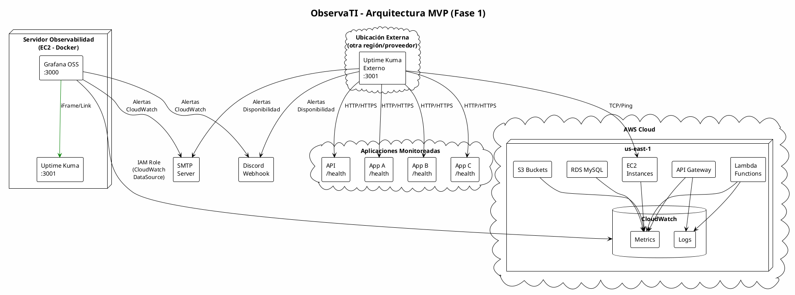
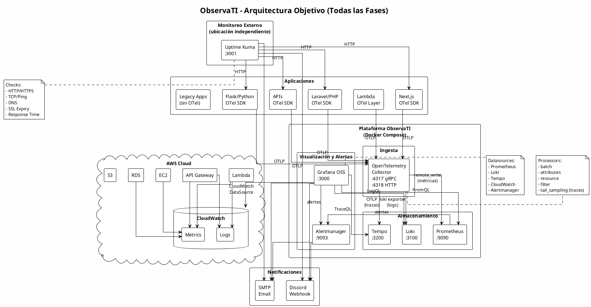

# ObservaTI - Arquitectura de Plataforma de Observabilidad

## Índice

1. [Evaluación de Arquitectura](#1-evaluación-de-arquitectura)
2. [Diagrama de Arquitectura](#2-diagrama-de-arquitectura)
3. [Flujo de Datos](#3-flujo-de-datos)
4. [Plan de Implementación](#4-plan-de-implementación)
5. [Requisitos AWS](#5-requisitos-aws)
6. [Dimensionamiento](#6-dimensionamiento)
7. [Estructura del Proyecto](#7-estructura-del-proyecto)
8. [Riesgos](#8-riesgos)
9. [Información Adicional Requerida](#9-información-adicional-requerida)

---

## 1. Evaluación de Arquitectura

### 1.1 Análisis de la propuesta

La propuesta arquitectónica es sólida y sigue las mejores prácticas actuales de observabilidad.
No presenta errores arquitectónicos fundamentales. Sin embargo, hay puntos a refinar:

### 1.2 Observaciones y refinamientos

#### Lo que está bien planteado

| Decisión | Razón |
|----------|-------|
| OpenTelemetry como capa de abstracción | Desacopla aplicaciones del backend de observabilidad |
| Implementación incremental por fases | Reduce riesgo y permite validar valor en cada paso |
| Grafana OSS como punto único de visualización | Evita fragmentación de dashboards |
| CloudWatch directo desde Grafana (sin copiar a Prometheus) | Evita duplicación de datos y costos innecesarios |
| Uptime Kuma separado para monitoreo externo | Independencia del stack principal |
| Discord + SMTP como canales de alerta | Pragmático y sin costo adicional |

#### Puntos a refinar

| Punto | Observación | Recomendación |
|-------|-------------|---------------|
| Alertmanager vs Grafana Alerting | Grafana 11+ incluye un motor de alertas unificado muy capaz | Fase 1: usar Grafana Alerting únicamente. Agregar Alertmanager solo en Fase 2 cuando Prometheus lo requiera |
| Prometheus en Fase 2 | Correcto. No es necesario para el MVP si CloudWatch cubre métricas AWS | Mantener como está |
| OTel Collector en Fase 1 | No aporta valor si no hay aplicaciones instrumentadas todavía | Mover a Fase 2 junto con Prometheus |
| Loki ingesta vía OTel vs directo | OTel Collector como pipeline de logs es más flexible | Preferir: App → OTel Collector → Loki (Fase 3) |

### 1.3 Componentes: necesidad real por fase

| Componente | Fase 1 (MVP) | Fase 2 | Fase 3 | Fase 4 | Justificación |
|------------|:---:|:---:|:---:|:---:|---------------|
| Grafana OSS | ✅ | ✅ | ✅ | ✅ | Visualización centralizada desde el día 1 |
| CloudWatch (datasource) | ✅ | ✅ | ✅ | ✅ | Fuente principal de métricas AWS |
| Uptime Kuma | ✅ | ✅ | ✅ | ✅ | Monitoreo externo de disponibilidad |
| Grafana Alerting | ✅ | ✅ | ✅ | ✅ | Motor de alertas integrado en Grafana |
| Prometheus | ❌ | ✅ | ✅ | ✅ | Métricas de aplicaciones (no AWS) |
| Alertmanager | ❌ | ✅ | ✅ | ✅ | Gestión avanzada de alertas de Prometheus |
| OTel Collector | ❌ | ✅ | ✅ | ✅ | Pipeline de telemetría |
| Loki | ❌ | ❌ | ✅ | ✅ | Centralización de logs |
| Tempo | ❌ | ❌ | ❌ | ✅ | Trazas distribuidas |

### 1.4 Componentes eliminados o pospuestos del MVP

| Componente | Razón para posponer |
|------------|-------------------|
| Prometheus | CloudWatch cubre métricas AWS. Sin apps instrumentadas, no tiene qué scrapear |
| Alertmanager | Grafana Alerting cubre alertas del MVP. Alertmanager se necesita cuando Prometheus entra |
| OTel Collector | Sin aplicaciones instrumentadas, no hay telemetría que procesar |
| Loki | Los logs se consultan vía CloudWatch Logs directamente desde Grafana en Fase 1 |
| Tempo | Las trazas son el último pilar; requiere instrumentación activa en las apps |

### 1.5 Responsabilidad de cada componente

| Componente | Responsabilidad |
|------------|----------------|
| **Grafana OSS** | Visualización unificada, dashboards, exploración de datos, alertas (Fase 1) |
| **CloudWatch** | Fuente de métricas y logs de servicios AWS (EC2, Lambda, RDS, API GW, S3) |
| **Uptime Kuma** | Verificación externa de disponibilidad HTTP/TCP/DNS/SSL/Ping |
| **Prometheus** | Almacenamiento de métricas de aplicaciones, scraping de exporters |
| **Alertmanager** | Routing, agrupación, deduplicación y silenciamiento de alertas de Prometheus |
| **OTel Collector** | Recepción, procesamiento y exportación de métricas/logs/trazas |
| **Loki** | Almacenamiento e indexación de logs |
| **Tempo** | Almacenamiento de trazas distribuidas |
| **Discord Webhook** | Canal primario de notificación de alertas |
| **SMTP** | Canal secundario de notificación de alertas |

### 1.6 Flujo de información entre componentes

```
┌─────────────────────────────────────────────────────────────────────┐
│                        APLICACIONES                                   │
│  Laravel, Flask, Next.js, React, Lambda, APIs, Batch, Legacy         │
└───────────────────────────────┬─────────────────────────────────────┘
                                │
                    ┌───────────▼───────────┐
                    │  OpenTelemetry SDK     │  (instrumentación en apps)
                    └───────────┬───────────┘
                                │ OTLP (gRPC/HTTP)
                    ┌───────────▼───────────┐
                    │  OTel Collector        │  (recibe, procesa, exporta)
                    └──┬────────┬────────┬──┘
                       │        │        │
              metrics  │  logs  │ traces │
                       │        │        │
              ┌────────▼─┐  ┌──▼────┐  ┌▼───────┐
              │Prometheus │  │ Loki  │  │ Tempo  │
              └─────┬─────┘  └──┬────┘  └───┬────┘
                    │           │            │
                    └───────────┼────────────┘
                                │
                    ┌───────────▼───────────┐
                    │      Grafana OSS      │◄──── CloudWatch (datasource directo)
                    └───────────┬───────────┘
                                │
                    ┌───────────▼───────────┐
                    │   Grafana Alerting    │
                    │   + Alertmanager      │
                    └──────┬─────────┬──────┘
                           │         │
                    ┌──────▼──┐  ┌───▼──────┐
                    │ Discord │  │  SMTP    │
                    └─────────┘  └──────────┘


   SEPARADO (red independiente):

                    ┌───────────────────────┐
                    │    Uptime Kuma         │──── Verifica endpoints externamente
                    └──────┬─────────┬──────┘
                           │         │
                    ┌──────▼──┐  ┌───▼──────┐
                    │ Discord │  │  SMTP    │
                    └─────────┘  └──────────┘
```

---

## 2. Diagrama de Arquitectura

### 2.1 Arquitectura MVP (Fase 1)



### 2.2 Arquitectura Objetivo (Fase 4 completa)



---

## 3. Flujo de Datos

### 3.1 Métricas

#### Fase 1 (MVP) - Solo CloudWatch

```
AWS Services (EC2, Lambda, RDS, API GW)
        │
        ▼
   CloudWatch Metrics
        │
        ▼ (API directa, IAM Role)
   Grafana OSS ──► Dashboards
        │
        ▼
   Grafana Alerting ──► Discord / SMTP
```

#### Fase 2+ - CloudWatch + Prometheus

```
AWS Services                    Aplicaciones instrumentadas
     │                                    │
     ▼                                    ▼ (OTLP)
CloudWatch Metrics              OTel Collector
     │                                    │
     │                                    ▼ (remote_write)
     │                              Prometheus
     │                                    │
     ▼ (CloudWatch DataSource)            ▼ (Prometheus DataSource)
     └──────────── Grafana OSS ───────────┘
                       │
                       ▼
              Grafana Alerting + Alertmanager
                       │
                       ▼
               Discord / SMTP
```

**Decisión clave**: CloudWatch NO se copia a Prometheus.
- Métricas AWS → se consultan directamente vía CloudWatch DataSource.
- Métricas de aplicación → van a Prometheus vía OTel Collector.
- Esto evita costos de GetMetricData excesivos y almacenamiento duplicado.

**Cuándo SÍ copiar de CloudWatch a Prometheus**:
- Cuando se necesiten alertas con PromQL sobre métricas AWS (caso raro).
- Cuando se requiera correlación temporal exacta entre métricas AWS y métricas de app.
- En esos casos, usar `yet-another-cloudwatch-exporter` (YACE) selectivamente.

### 3.2 Logs

#### Fase 1 (MVP) - Solo CloudWatch Logs

```
Lambda / API Gateway / EC2 (CloudWatch Agent)
        │
        ▼
   CloudWatch Logs
        │
        ▼ (CloudWatch Logs DataSource)
   Grafana OSS ──► Exploración de logs
```

#### Fase 3 - Loki

```
Aplicaciones instrumentadas
        │
        ▼ (OTLP)
   OTel Collector
        │
        ▼ (Loki exporter)
      Loki
        │
        ▼ (Loki DataSource)
   Grafana OSS ──► LogQL queries

   CloudWatch Logs se mantiene para logs AWS nativos.
   Loki se usa para logs de aplicaciones propias.
```

**Decisión**: Aplicación → OTel Collector → Loki (no directo a Loki).
- Razón: OTel Collector permite enriquecer, filtrar y transformar logs antes de almacenarlos.
- Permite cambiar el backend de logs sin tocar las aplicaciones.
- Permite enrutar logs a múltiples destinos si fuera necesario.

### 3.3 Trazas

#### Fase 4 - Tempo

```
Aplicaciones instrumentadas (OTel SDK)
        │
        ▼ (OTLP gRPC :4317 o HTTP :4318)
   OTel Collector
        │
        ├──► Processors: batch, tail_sampling
        │
        ▼ (OTLP exporter)
      Tempo
        │
        ▼ (Tempo DataSource)
   Grafana OSS ──► TraceQL, búsqueda por trace_id
```

**Correlación metrics-logs-traces**:
- Tempo genera métricas derivadas de trazas (span metrics) → Prometheus.
- Logs llevan `trace_id` como label → permite saltar de log a traza en Grafana.
- Grafana Exemplars vinculan métricas → trazas.
- Resultado: desde una métrica, se navega a la traza, y desde la traza al log.

### 3.4 Alertas

#### Fase 1 - Grafana Alerting

```
CloudWatch Metrics
        │
        ▼
Grafana Alert Rules (evaluación periódica)
        │
        ├── Condición cumplida
        │
        ▼
Grafana Contact Points
        │
        ├──► Discord Webhook
        └──► SMTP Email
```

#### Fase 2+ - Grafana Alerting + Alertmanager

```
Prometheus Alert Rules (prometheus.yml / rules/)
        │
        ▼ (condición cumplida)
   Alertmanager
        │
        ├── Agrupación (group_by)
        ├── Deduplicación
        ├── Silenciamiento (silences)
        ├── Inhibición (inhibit_rules)
        │
        ▼
   Receivers
        ├──► Discord Webhook
        └──► SMTP Email

   +

Grafana Alerting (para alertas sobre Loki, CloudWatch, Tempo)
        │
        ▼
   Contact Points ──► Discord / SMTP
```

---

## 4. Plan de Implementación

### 4.1 Tabla resumen

| Fase | Componentes | Objetivo | Complejidad | Riesgo | Duración estimada |
|------|------------|----------|:-----------:|:------:|:-----------------:|
| **1 - MVP** | Grafana, CloudWatch DS, Uptime Kuma, Discord, SMTP | Visibilidad básica AWS + disponibilidad externa + alertas | Baja | Bajo | 1-2 semanas |
| **2 - Métricas** | Prometheus, OTel Collector, Alertmanager | Métricas de aplicaciones propias | Media | Medio | 2-3 semanas |
| **3 - Logs** | Loki, OTel Collector (logs pipeline) | Centralización de logs de aplicaciones | Media | Medio | 2-3 semanas |
| **4 - Trazas** | Tempo, OTel SDK en apps | Trazabilidad distribuida end-to-end | Alta | Medio-Alto | 3-4 semanas |
| **5 - Avanzada** | SLIs/SLOs, correlación, dashboards ejecutivos | Observabilidad madura | Alta | Bajo | Continuo |

### 4.2 Detalle por fase

#### Fase 1 - MVP

**Componentes Docker Compose:**
- Grafana OSS
- Uptime Kuma (instancia interna para admin/dashboards)

**Componentes externos:**
- Uptime Kuma (instancia externa para verificaciones reales)
- CloudWatch (existente en AWS)

**Entregables:**
1. Docker Compose funcional con Grafana + Uptime Kuma.
2. Grafana configurado con CloudWatch DataSource (IAM Role).
3. Dashboards: Overview AWS, EC2, Lambda, RDS, API Gateway.
4. Uptime Kuma configurado con checks de salud por aplicación.
5. Alertas en Discord para: app caída, CPU alta, errores Lambda.
6. Alertas en SMTP como canal secundario.
7. Dashboard general de estado de aplicaciones.

**Criterio de éxito:**
- Puedo ver el estado de mis servicios AWS en Grafana.
- Recibo alerta en Discord si una aplicación cae.
- Puedo ver latencia y errores en API Gateway.
- Puedo agregar una nueva aplicación en menos de 10 minutos.

---

#### Fase 2 - Métricas de aplicaciones

**Componentes nuevos:**
- Prometheus
- Alertmanager
- OpenTelemetry Collector

**Entregables:**
1. Prometheus con configuración de scraping.
2. OTel Collector recibiendo métricas OTLP y exportando a Prometheus.
3. Alertmanager con routing a Discord y SMTP.
4. Primera aplicación instrumentada (piloto).
5. Dashboards por aplicación con métricas de negocio.

**Criterio de éxito:**
- Puedo ver métricas custom de mis aplicaciones.
- Alertas de Prometheus llegan a Discord agrupadas y sin ruido.
- Una aplicación envía métricas vía OTel SDK → Collector → Prometheus → Grafana.

---

#### Fase 3 - Logs centralizados

**Componentes nuevos:**
- Loki

**Entregables:**
1. Loki configurado con almacenamiento local (filesystem).
2. OTel Collector configurado como pipeline de logs.
3. Primera aplicación enviando logs vía OTel SDK.
4. Dashboard de exploración de logs en Grafana.
5. Alertas basadas en patrones de logs (errores repetidos).

**Criterio de éxito:**
- Puedo buscar logs de cualquier aplicación instrumentada desde Grafana.
- Los logs tienen labels estándar: service.name, environment, level.
- Puedo filtrar logs por aplicación, ambiente y severidad.

---

#### Fase 4 - Trazas distribuidas

**Componentes nuevos:**
- Tempo

**Entregables:**
1. Tempo configurado para recibir trazas OTLP.
2. OTel Collector con tail sampling configurado.
3. Al menos un flujo end-to-end instrumentado.
4. Correlación trace_id en logs.
5. Navegación Grafana: métrica → traza → logs.

**Criterio de éxito:**
- Puedo seguir una request desde el frontend hasta la base de datos.
- Desde un log de error, puedo saltar a la traza completa.
- Puedo identificar qué servicio introduce latencia.

---

## 5. Requisitos AWS

### 5.1 IAM - Política para Grafana CloudWatch DataSource

```json
{
    "Version": "2012-10-17",
    "Statement": [
        {
            "Sid": "GrafanaCloudWatchReadOnly",
            "Effect": "Allow",
            "Action": [
                "cloudwatch:DescribeAlarmsForMetric",
                "cloudwatch:DescribeAlarmHistory",
                "cloudwatch:DescribeAlarms",
                "cloudwatch:ListMetrics",
                "cloudwatch:GetMetricData",
                "cloudwatch:GetInsightRuleReport"
            ],
            "Resource": "*"
        },
        {
            "Sid": "GrafanaCloudWatchLogsReadOnly",
            "Effect": "Allow",
            "Action": [
                "logs:DescribeLogGroups",
                "logs:GetLogGroupFields",
                "logs:StartQuery",
                "logs:StopQuery",
                "logs:GetQueryResults",
                "logs:GetLogEvents"
            ],
            "Resource": "*"
        },
        {
            "Sid": "GrafanaEC2DescribeRegions",
            "Effect": "Allow",
            "Action": [
                "ec2:DescribeRegions"
            ],
            "Resource": "*"
        },
        {
            "Sid": "GrafanaResourceTagsReadOnly",
            "Effect": "Allow",
            "Action": [
                "tag:GetResources"
            ],
            "Resource": "*"
        }
    ]
}
```

**Método de autenticación recomendado (orden de preferencia):**

1. **EC2 Instance Profile (IAM Role)** - Si Grafana corre en EC2 en la misma cuenta.
   - Sin credenciales estáticas.
   - Rotación automática.
   - Mínimo privilegio.

2. **IAM Role con AssumeRole (cross-account)** - Si se monitorean múltiples cuentas AWS.
   - Un rol en cada cuenta monitoreada.
   - La instancia de observabilidad asume roles remotos.

3. **Access Keys (último recurso)** - Solo si no hay otra opción.
   - Almacenar en AWS Secrets Manager o variables de entorno.
   - NUNCA en el repositorio.
   - Rotación obligatoria cada 90 días.

### 5.2 Security Groups

#### SG: observability-server

| Tipo | Protocolo | Puerto | Origen | Descripción |
|------|-----------|--------|--------|-------------|
| Inbound | TCP | 3000 | VPN/Office CIDR | Grafana UI |
| Inbound | TCP | 3001 | VPN/Office CIDR | Uptime Kuma UI |
| Inbound | TCP | 22 | VPN/Bastion SG | SSH administración |
| Inbound | TCP | 4317 | App SG / VPC CIDR | OTel gRPC (Fase 2+) |
| Inbound | TCP | 4318 | App SG / VPC CIDR | OTel HTTP (Fase 2+) |
| Outbound | TCP | 443 | 0.0.0.0/0 | CloudWatch API, Discord Webhook, SMTP |
| Outbound | TCP | 587 | SMTP Server IP | SMTP (starttls) |
| Outbound | TCP | 80/443 | 0.0.0.0/0 | Uptime Kuma checks |

**Puertos internos (solo localhost/docker network, NO expuestos a internet):**

| Puerto | Servicio |
|--------|----------|
| 9090 | Prometheus |
| 9093 | Alertmanager |
| 3100 | Loki |
| 3200 | Tempo |

### 5.3 Configuración de red

```
VPC
├── Subnet privada (observabilidad)
│   └── EC2 observability-server
│       ├── Grafana :3000
│       ├── Prometheus :9090 (solo interno)
│       ├── Loki :3100 (solo interno)
│       ├── Tempo :3200 (solo interno)
│       └── OTel Collector :4317/:4318
│
├── Subnet privada (aplicaciones)
│   └── EC2 apps → envían telemetría al Collector
│
└── NAT Gateway (para acceso saliente a CloudWatch API)
```

**Acceso a Grafana:**
- Opción A: ALB + ACM certificate + WAF (recomendado para producción).
- Opción B: VPN + acceso directo al SG (más simple para inicio).
- Opción C: Cloudflare Tunnel (zero trust, sin exponer puertos).

### 5.4 Roles necesarios

| Rol | Propósito | Adjuntado a |
|-----|-----------|-------------|
| `observati-grafana-role` | Lectura CloudWatch Metrics + Logs | EC2 Instance Profile |
| `observati-cross-account-role` | AssumeRole desde cuenta observabilidad | Cuentas AWS adicionales |

### 5.5 Permisos CloudWatch - Costo estimado

| Operación | Costo | Notas |
|-----------|-------|-------|
| GetMetricData | $0.01 por 1,000 métricas solicitadas | Principal costo de Grafana → CW |
| CloudWatch Logs Insights | $0.0076 por GB escaneado | Solo si se usan queries en Grafana |
| ListMetrics | Gratis | Descubrimiento de métricas |
| PutMetricData | $0.01 por 1,000 métricas | Solo si se envían métricas custom |

**Mitigación de costos CloudWatch:**
- Usar periodos de refresco largos en dashboards (1-5 min, no 10s).
- Limitar el rango de tiempo por defecto en dashboards (últimas 3h, no 24h).
- Evitar dashboards con muchas métricas cargando simultáneamente.
- Usar CloudWatch Metric Streams solo si el volumen justifica el costo.

---

## 6. Dimensionamiento

### 6.1 Laboratorio / Desarrollo

| Recurso | Especificación |
|---------|---------------|
| Instancia | t3.small |
| vCPU | 2 |
| RAM | 2 GB |
| Almacenamiento | 30 GB gp3 |
| SO | Ubuntu 24.04 LTS / Amazon Linux 2023 |
| Docker | Docker CE + Compose v2 |
| Componentes | Grafana + Uptime Kuma |
| Aplicaciones monitoreadas | 1-3 |
| Costo estimado EC2 | ~$15-20/mes (on-demand) |

**Notas:** Suficiente para Fase 1. No para Prometheus + Loki + Tempo simultáneo.

### 6.2 Producción pequeña (5-10 aplicaciones)

| Recurso | Especificación |
|---------|---------------|
| Instancia | t3.medium |
| vCPU | 2 |
| RAM | 4 GB |
| Almacenamiento | 80 GB gp3 (3000 IOPS) |
| SO | Ubuntu 24.04 LTS / Amazon Linux 2023 |
| Docker | Docker CE + Compose v2 |
| Componentes | Todos (Grafana, Prometheus, Loki, Tempo, OTel, Alertmanager, Uptime Kuma) |
| Aplicaciones monitoreadas | 5-10 |
| Retención métricas | 15 días |
| Retención logs | 15 días |
| Retención trazas | 7 días |
| Costo estimado EC2 | ~$30-40/mes (on-demand), ~$18-25/mes (reserved 1y) |

**Notas:** Adecuado para la mayoría de organizaciones pequeñas-medianas. Monitorear uso de disco.

### 6.3 Producción media (10-30 aplicaciones)

| Recurso | Especificación |
|---------|---------------|
| Instancia | t3.large o m6i.large |
| vCPU | 2-4 |
| RAM | 8 GB |
| Almacenamiento | 200 GB gp3 (3000 IOPS, 125 MB/s throughput) |
| SO | Ubuntu 24.04 LTS |
| Docker | Docker CE + Compose v2 |
| Componentes | Todos |
| Aplicaciones monitoreadas | 10-30 |
| Retención métricas | 30 días |
| Retención logs | 30 días |
| Retención trazas | 14 días |
| Costo estimado EC2 | ~$60-80/mes (on-demand), ~$40-55/mes (reserved 1y) |

**Notas:** Considerar separar Uptime Kuma en otra instancia/ubicación. Evaluar si Loki necesita object storage (S3) para retención larga.

### 6.4 Ubicación de Uptime Kuma (análisis HA)

| Opción | Ventajas | Desventajas | Costo adicional |
|--------|----------|-------------|:---------------:|
| **Misma EC2 que observabilidad** | Simple, sin costo adicional | Si la instancia cae, pierdes monitoreo Y alertas de disponibilidad | $0 |
| **Otra EC2 en otra región AWS** | Independiente de la región monitoreada, misma cuenta | Costo de EC2 adicional, misma cuenta (si cuenta comprometida, todo cae) | ~$8-15/mes (t3.micro) |
| **Otra cuenta AWS** | Aislamiento total de blast radius | Más complejidad de gestión | ~$8-15/mes + gestión |
| **VPS externo (Hetzner, DigitalOcean)** | Independencia total de AWS, costo bajo | Otro proveedor que gestionar | ~$4-6/mes |
| **Infraestructura local (oficina)** | Sin dependencia de ningún cloud | Depende de internet de oficina, no es 24/7 confiable | ~$0 (hardware existente) |

**Recomendación:**
- **Fase 1**: Uptime Kuma en la misma instancia (simplicidad), PERO con plan de moverlo.
- **Producción real**: Uptime Kuma en un t3.micro en otra región (us-west-2) o un VPS externo (~$5/mes).
- **Máxima resiliencia**: VPS externo (Hetzner Cloud, ~€4/mes) + Uptime Kuma en otra región AWS.

La regla fundamental: **el monitor no debe estar en la misma zona de fallo que lo monitoreado**.

---

## 7. Estructura del Proyecto

```
observati/
│
├── docker-compose.yml              # Compose principal (todos los servicios)
├── docker-compose.override.yml     # Overrides para desarrollo local
├── .env.example                    # Variables de entorno (template)
├── .gitignore
├── README.md
├── Makefile                        # Comandos útiles (up, down, logs, backup)
│
├── grafana/
│   ├── grafana.ini                 # Configuración principal Grafana
│   └── provisioning/
│       ├── dashboards/
│       │   ├── dashboard.yml       # Provider de dashboards
│       │   ├── overview/
│       │   │   └── application-health.json
│       │   ├── aws/
│       │   │   ├── ec2-overview.json
│       │   │   ├── lambda-overview.json
│       │   │   ├── rds-overview.json
│       │   │   └── apigateway-overview.json
│       │   └── applications/
│       │       └── app-template.json
│       ├── datasources/
│       │   └── datasources.yml     # CloudWatch, Prometheus, Loki, Tempo
│       └── alerting/
│           ├── contact-points.yml  # Discord, SMTP
│           ├── notification-policies.yml
│           └── alert-rules/
│               ├── aws-alerts.yml
│               └── availability-alerts.yml
│
├── prometheus/
│   ├── prometheus.yml              # Configuración principal
│   └── rules/
│       ├── application-alerts.yml
│       ├── infrastructure-alerts.yml
│       └── recording-rules.yml
│
├── alertmanager/
│   └── alertmanager.yml            # Routing, receivers, inhibit rules
│
├── loki/
│   └── loki-config.yml            # Almacenamiento, retención, limits
│
├── tempo/
│   └── tempo.yml                  # Almacenamiento, retención, sampling
│
├── otel/
│   └── otel-collector.yml         # Receivers, processors, exporters
│
├── uptime-kuma/
│   └── README.md                  # Instrucciones de configuración
│
├── scripts/
│   ├── backup.sh                  # Backup de configuración y datos
│   ├── restore.sh                 # Restauración
│   ├── health-check.sh            # Verificación de salud del stack
│   └── add-application.sh         # Helper para agregar nueva app
│
└── docs/
    ├── architecture.md            # Este documento
    ├── installation.md            # Guía de instalación paso a paso
    ├── applications.md            # Cómo instrumentar cada tipo de app
    ├── alerts.md                  # Catálogo de alertas y severidades
    ├── runbooks/                  # Procedimientos de respuesta
    │   ├── app-down.md
    │   ├── high-cpu.md
    │   └── high-error-rate.md
    ├── conventions.md             # Convenciones de naming y labels
    └── troubleshooting.md         # Problemas comunes y soluciones
```

### Notas sobre la estructura

- `docker-compose.override.yml` permite ajustes locales sin modificar el compose principal.
- Los dashboards se versionan como JSON (Grafana provisioning).
- Las alertas se definen como código (YAML provisioning).
- `uptime-kuma/` no tiene configuración YAML porque Uptime Kuma se configura vía UI y persiste en SQLite. Se documenta en README.
- `scripts/` proporciona automatización para operaciones comunes.
- `docs/runbooks/` facilita la respuesta a incidentes.

---

## 8. Riesgos

### 8.1 Riesgos técnicos

| Riesgo | Probabilidad | Impacto | Mitigación |
|--------|:------------:|:-------:|------------|
| OTel Collector como single point of failure | Media | Alto | Configurar health checks, restart policy, evaluar réplica en producción media |
| Prometheus se queda sin disco | Alta | Alto | Configurar retención agresiva (15d), alertar al 80% de disco, monitorear tsdb |
| Loki overwhelmed por volumen de logs | Media | Medio | Configurar rate limits, filtrar logs verbosos en OTel Collector, usar sampling |
| Tempo almacenando demasiadas trazas | Media | Medio | Implementar tail_sampling en OTel Collector (solo errores + muestreo %) |
| Grafana lento con muchos dashboards | Baja | Bajo | Optimizar queries, usar periodos razonables, caching |
| Incompatibilidad de versiones entre componentes | Baja | Medio | Fijar versiones, probar upgrades en staging primero |

### 8.2 Riesgos operativos

| Riesgo | Probabilidad | Impacto | Mitigación |
|--------|:------------:|:-------:|------------|
| Nadie mantiene la plataforma | Media | Alto | Documentar todo, automatizar, runbooks claros |
| Alert fatigue (demasiadas alertas) | Alta | Alto | Diseñar thresholds conservadores, iterar, usar agrupación y silencios |
| Aplicaciones no se instrumentan | Alta | Medio | Empezar con 1-2 apps piloto, documentar el proceso, hacerlo fácil |
| Docker Compose no escala | Baja (a corto plazo) | Bajo | Diseño permite migrar a ECS/K8s si se necesita |
| Pérdida de datos por docker compose down sin volúmenes | Media | Alto | Volúmenes persistentes obligatorios, verificar en setup |

### 8.3 Riesgos de almacenamiento

| Riesgo | Probabilidad | Impacto | Mitigación |
|--------|:------------:|:-------:|------------|
| Disco EBS se llena | Media | Alto | Alertar al 80%, retención automática, limpieza programada |
| Logs de alta cardinalidad en Loki | Media | Medio | Evitar labels dinámicos (user_id, request_id como label), usar structured metadata |
| Prometheus high cardinality | Media | Medio | Limitar labels, usar relabeling, monitorear series activas |
| Backups no se realizan | Alta | Alto | Automatizar con cron, verificar periódicamente |
| Corrupción de datos en volúmenes Docker | Baja | Alto | Backups regulares, usar gp3 con snapshots EBS |

### 8.4 Riesgos de costos

| Riesgo | Probabilidad | Impacto | Mitigación |
|--------|:------------:|:-------:|------------|
| CloudWatch GetMetricData excesivo | Media | Medio | Limitar refresh rate, reducir métricas en dashboards, dashboards por demanda |
| CloudWatch Logs Insights queries caros | Baja | Bajo | Usar Loki para búsquedas frecuentes, CW Logs solo para ad-hoc |
| EBS storage creciendo sin control | Media | Medio | Retención automática, políticas de lifecycle, monitoreo |
| Transferencia de datos entre regiones (Uptime Kuma) | Baja | Bajo | Mínimo tráfico (solo health checks), ~$1-2/mes |
| EC2 sobredimensionado | Media | Bajo | Empezar con t3.small, escalar según métricas reales |

### 8.5 Riesgos de seguridad

| Riesgo | Probabilidad | Impacto | Mitigación |
|--------|:------------:|:-------:|------------|
| Grafana expuesto a internet sin autenticación | Media | Crítico | Security Group restrictivo, VPN/ALB+WAF, auth obligatoria |
| Credenciales AWS en repositorio | Baja | Crítico | .gitignore, .env.example sin valores, pre-commit hooks |
| OTel Collector abierto a internet | Baja | Alto | Solo accesible desde VPC, Security Group restrictivo |
| Acceso no autorizado a métricas/logs | Media | Medio | Grafana RBAC, folders por equipo, org separation |
| IAM Role con permisos excesivos | Media | Medio | Política de solo lectura, no usar AdministratorAccess |
| Datos sensibles en logs | Alta | Medio | Filtrar PII en OTel Collector processors, no loguear passwords/tokens |

---

## 9. Información Adicional Requerida

Para avanzar con la implementación de la Fase 1, necesito conocer:

### Infraestructura actual

| Pregunta | Para qué se necesita |
|----------|---------------------|
| ¿En qué cuenta AWS se desplegará el servidor de observabilidad? | Configurar IAM Role y networking |
| ¿Existe una VPC con subnets privadas disponible? | Definir dónde colocar el EC2 |
| ¿Hay VPN o bastion host configurado para acceso? | Definir cómo acceder a Grafana de forma segura |
| ¿Se usa algún dominio para servicios internos? (ej: *.internal.midominio.com) | Configurar Grafana con dominio y TLS |
| ¿Cuántas cuentas AWS se necesitan monitorear inicialmente? | Definir si se necesita cross-account desde el inicio |

### Aplicaciones

| Pregunta | Para qué se necesita |
|----------|---------------------|
| ¿Cuántas aplicaciones se monitorearán en Fase 1? | Dimensionar y configurar Uptime Kuma |
| ¿Tienen endpoints /health actualmente? | Saber si se necesita implementarlos primero |
| ¿Qué aplicación sería la piloto para instrumentación OTel (Fase 2)? | Planificar la integración |
| ¿Las aplicaciones están en EC2, ECS, Lambda, o mixto? | Definir cómo llega la telemetría |

### Alertas

| Pregunta | Para qué se necesita |
|----------|---------------------|
| ¿Ya existe un Webhook de Discord? ¿Se creará un canal dedicado? | Configurar contact point en Grafana |
| ¿Qué servidor SMTP se usará? (SES, Gmail, servidor propio) | Configurar SMTP en Grafana y Uptime Kuma |
| ¿Quién debe recibir las alertas por correo? | Configurar destinatarios |
| ¿Hay horarios donde las alertas deben silenciarse? (mantenimientos programados) | Configurar silences |

### Operaciones

| Pregunta | Para qué se necesita |
|----------|---------------------|
| ¿Existe un repositorio Git donde se almacenará esta configuración? | Definir flujo de versionamiento |
| ¿Quién operará la plataforma? ¿Un equipo DevOps, un SRE, o los mismos desarrolladores? | Definir nivel de documentación y automatización |
| ¿Existe alguna herramienta de IaC en uso? (Terraform, CloudFormation, CDK) | Evaluar si el EC2 se aprovisiona con IaC |

---

## 10. Decisiones Técnicas Clave

### 10.1 ¿Por qué Grafana Alerting en lugar de solo Alertmanager para Fase 1?

- Grafana 11+ tiene un sistema de alertas maduro con soporte nativo para CloudWatch.
- Alertmanager no puede evaluar queries de CloudWatch directamente.
- Grafana Alerting puede alertar sobre CUALQUIER datasource (CloudWatch, Loki, Prometheus).
- Alertmanager solo recibe alertas de Prometheus.
- En Fase 2, Alertmanager se agrega como receptor de alertas de Prometheus, y Grafana Alerting sigue manejando alertas de CloudWatch y Loki.

### 10.2 ¿Por qué NO copiar métricas de CloudWatch a Prometheus?

- CloudWatch cobra por GetMetricData ($0.01/1000 métricas).
- Si scrapeas con un exporter cada 60s, los costos se multiplican.
- Grafana consulta CloudWatch bajo demanda (solo cuando alguien ve el dashboard).
- Las alertas de Grafana consultan periódicamente, pero con frecuencia configurable (1-5 min).
- Resultado: significativamente más barato que un exporter corriendo continuamente.

**Excepción**: Si necesitas PromQL sobre métricas AWS (ej: para recording rules complejas), entonces sí se justifica YACE para métricas específicas.

### 10.3 ¿Por qué OTel Collector como intermediario y no SDKs directo a backends?

```
✅ RECOMENDADO:  App → OTel Collector → Prometheus/Loki/Tempo
❌ NO RECOMENDADO: App → Prometheus/Loki/Tempo directamente
```

Razones:
1. **Desacoplamiento**: Cambiar de Prometheus a Mimir, o de Loki a Elasticsearch, no requiere tocar las apps.
2. **Procesamiento centralizado**: Filtrado, enriquecimiento, sampling en un solo punto.
3. **Resiliencia**: El Collector puede buffear si un backend está caído temporalmente.
4. **Multi-tenancy**: El Collector puede agregar labels de ambiente/equipo.
5. **Reducción de carga en apps**: Las apps solo envían, el Collector procesa.

### 10.4 Retención recomendada

| Componente | Retención | Justificación |
|------------|-----------|---------------|
| **Prometheus** | 15 días | Métricas de alta resolución. Para histórico largo, usar recording rules o Thanos/Mimir (futuro) |
| **Loki** | 15 días | Logs son voluminosos. 15 días cubre la mayoría de investigaciones. Puede extenderse a 30 con más disco |
| **Tempo** | 7 días | Las trazas son las más voluminosas y las menos consultadas históricamente. 7 días es suficiente para debugging |
| **Grafana** | Indefinida | Los dashboards son configuración, no datos. Se versionan en Git |
| **Uptime Kuma** | 90 días | Historial de disponibilidad. SQLite, bajo volumen |

### 10.5 Convenciones de identificación (Resource Attributes)

Todas las aplicaciones DEBEN enviar al mínimo:

| Atributo | Obligatorio | Ejemplo | Uso |
|----------|:-----------:|---------|-----|
| `service.name` | ✅ | `redapp` | Identificación principal del servicio |
| `service.namespace` | ✅ | `nuestrodiario` | Agrupación lógica / producto |
| `deployment.environment.name` | ✅ | `production` | Filtrado por ambiente |
| `service.version` | ✅ | `2.4.1` | Correlación con deploys |
| `cloud.provider` | Recomendado | `aws` | Contexto de infraestructura |
| `cloud.region` | Recomendado | `us-east-1` | Filtrado por región |
| `cloud.account.id` | Recomendado | `123456789012` | Multi-cuenta |
| `host.name` | Recomendado | `ip-10-0-1-42` | Identificación de host |
| `team.name` | Custom | `backend` | Routing de alertas por equipo |

### 10.6 Estándar de endpoint /health

```
GET /health
Response 200:
{
  "status": "healthy",
  "timestamp": "2025-01-15T10:30:00Z"
}

Response 503:
{
  "status": "unhealthy",
  "timestamp": "2025-01-15T10:30:00Z"
}
```

**Reglas:**
- No exponer detalles internos (versión de BD, credenciales, IPs internas).
- Retornar 200 si puede atender solicitudes.
- Retornar 503 si no puede.
- Latencia del health check debe ser < 500ms.
- No hacer queries pesados en el health check.

**Opcional para uso interno (no expuesto públicamente):**

```
GET /health/ready   → ¿Puede recibir tráfico? (dependencias listas)
GET /health/live    → ¿El proceso está vivo? (no está en deadlock)
```

### 10.7 Estados de aplicación

| Estado | Condición | Visualización |
|--------|-----------|:-------------:|
| **UP** | HTTP 200 en /health, latencia < umbral, error rate < 1% | 🟢 |
| **DEGRADED** | HTTP 200 pero latencia > umbral, o error rate 1-5% | 🟡 |
| **DOWN** | No responde, HTTP 5XX, o error rate > 5% durante 3+ minutos | 🔴 |
| **UNKNOWN** | Sin datos suficientes (app nueva, monitoreo recién configurado) | ⚪ |

---

## 11. Niveles de Severidad y Ejemplos de Alertas

### Definición

| Severidad | Criterio | Acción esperada | Canal |
|-----------|----------|-----------------|-------|
| **INFO** | Evento notable pero no requiere acción inmediata | Revisar en horario laboral | Discord (canal info) |
| **WARNING** | Degradación que podría escalar si no se atiende | Investigar en < 4 horas | Discord + Email |
| **CRITICAL** | Servicio caído o degradación severa que afecta usuarios | Respuesta inmediata | Discord + Email + Mención @here |

### Catálogo inicial de alertas

| Alerta | Severidad | Condición | Ventana |
|--------|-----------|-----------|---------|
| App no responde | CRITICAL | /health retorna != 200 | 3 minutos consecutivos |
| CPU alta | WARNING | CPU > 80% | 10 minutos sostenidos |
| CPU crítica | CRITICAL | CPU > 95% | 5 minutos sostenidos |
| Memoria alta | WARNING | Memoria > 85% | 10 minutos |
| Disco lleno | CRITICAL | Disco > 90% | 5 minutos |
| Error rate alto | WARNING | HTTP 5XX > 5% del total | 5 minutos |
| Error rate crítico | CRITICAL | HTTP 5XX > 20% del total | 3 minutos |
| Lambda errores | WARNING | Error count > 5 en ventana | 5 minutos |
| Lambda throttled | WARNING | Throttle count > 0 | 5 minutos |
| RDS conexiones | WARNING | Conexiones > 80% del max | 10 minutos |
| RDS CPU | WARNING | CPU > 80% | 10 minutos |
| SSL por vencer | WARNING | Certificado vence en < 15 días | 1 check/día |
| SSL crítico | CRITICAL | Certificado vence en < 3 días | 1 check/12h |
| Latencia alta | WARNING | p95 > 2s | 5 minutos |
| Latencia crítica | CRITICAL | p95 > 5s | 3 minutos |

### Reglas anti-ruido

```yaml
# Alertmanager (Fase 2+)
group_by: ['service_name', 'environment', 'alertname']
group_wait: 30s          # Espera antes de enviar el primer grupo
group_interval: 5m       # Espera entre envíos del mismo grupo
repeat_interval: 4h      # No reenviar la misma alerta antes de 4h

# Inhibit: si un servicio está DOWN, suprimir WARNING del mismo servicio
inhibit_rules:
  - source_matchers: ['severity="critical"']
    target_matchers: ['severity="warning"']
    equal: ['service_name', 'environment']
```

**Principios:**
1. Nunca alertar por un solo datapoint (siempre ventanas de tiempo).
2. Agrupar alertas del mismo servicio.
3. Si algo es CRITICAL, suprimir los WARNING del mismo servicio.
4. Enviar notificación de recuperación (resolved).
5. Permitir silenciamientos programados para ventanas de mantenimiento.

---

## 12. Organización de Dashboards en Grafana

### Estructura de folders

```
Grafana
├── 📁 Overview
│   └── Application Health (vista general de todas las apps)
│
├── 📁 AWS Infrastructure
│   ├── EC2 Overview
│   ├── Lambda Overview
│   ├── RDS Overview
│   ├── API Gateway Overview
│   └── S3 Overview
│
├── 📁 Applications
│   ├── RedApp
│   ├── Aplicación B
│   └── Aplicación C
│
├── 📁 Platform
│   ├── Observability Stack Health
│   ├── Prometheus Stats
│   └── Loki Stats
│
└── 📁 Alerting
    └── Alert Overview
```

### Dashboard principal: Application Health

Responde de un vistazo:
- ¿Qué aplicaciones están UP/DOWN/DEGRADED?
- ¿Hay alertas activas?
- ¿Cuál es el error rate general?
- ¿Algún servicio AWS con problemas?

---

## 13. Próximos pasos

Una vez validada esta arquitectura, la implementación seguirá este orden:

1. **Crear estructura de directorios del proyecto.**
2. **Implementar Fase 1 (MVP):**
   - `docker-compose.yml` con Grafana + Uptime Kuma.
   - `.env.example` con variables necesarias.
   - Provisioning de datasources (CloudWatch).
   - Provisioning de dashboards iniciales.
   - Configuración de alertas a Discord.
   - Documentación de instalación.
3. **Validar** que el MVP funciona end-to-end.
4. **Iterar** hacia Fase 2 según necesidades.

---

*Documento generado para el proyecto ObservaTI.*
*Última actualización: Agosto 2026.*
